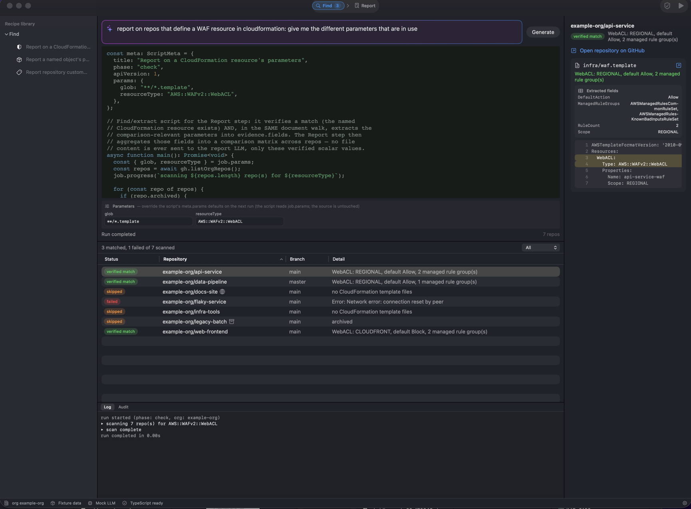
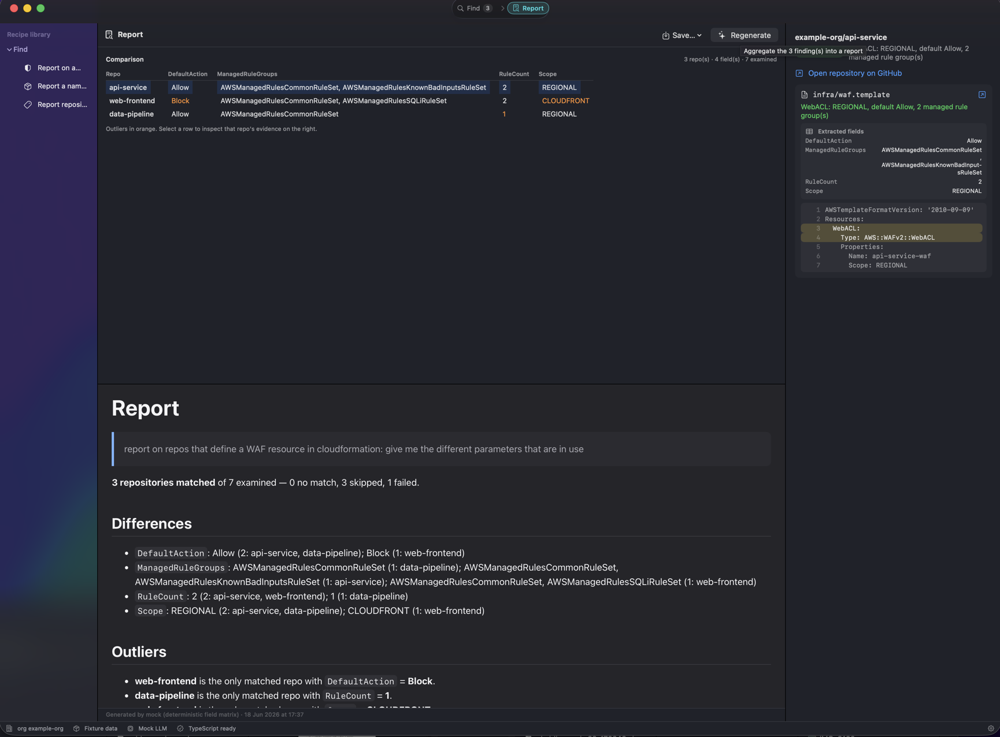

<p align="center">
  
</p>

# ReportGitHub

A native macOS workbench for **finding repositories across a GitHub
organisation and reporting on what they have in common** — the similarities,
differences, and outliers in how they're configured.

You describe what to find in natural language; an LLM writes a **TypeScript
script** against a small, typed host API; the app type-checks it, shows it for
review, and runs it in a sandboxed JavaScriptCore context wired to a read-only
capability handle. The script verifies each match deterministically **and
extracts the comparison-relevant values** from the matched file. Those verified
findings then feed a **report** that aggregates them.

ReportGitHub is a fork of [BulkGitHub](../bulkgithub) that keeps its read-only
**Find** step and replaces the bulk-update funnel with a **Report** step. It is
**read-only end to end** — it never writes branches, PRs, or merges.

**1 — Find** (read-only): describe what to find and which parameters to compare;
review the generated script; run it. Each match is verified against fetched
content, and the script attaches the extracted fields to the match (host rule:
a field can only be reported for a file actually fetched this run — same
provenance gate as the match itself).



**2 — Report**: the verified findings are aggregated into a deterministic
**field matrix** — one row per repo, columns of the extracted fields, with
per-field value distributions and flagged outliers. That matrix is the report's
grounded backbone; an LLM then narrates over it (similarities, differences,
outliers). The matrix is computed in pure Swift with no model, so the
quantitative answer is true regardless of the narrative — and the whole loop
runs offline against fixtures with a deterministic mock.



## The worked example — fully offline

The app launches in **fixture mode** with a **mock LLM**, so the whole
find → extract → matrix → report loop runs with no credentials.

Load **Report on a CloudFormation resource** from the recipe library — or type
`report on repos that define a WAF resource in cloudformation: give me the
different parameters that are in use` and press Generate; the mock returns a
script that scans `**/*.template`, finds each `AWS::WAFv2::WebACL`, and extracts
`Scope`, `DefaultAction`, `ManagedRuleGroups`, and `RuleCount`.

Run it against the 7-repo demo org:

- **3 matches** — api-service, web-frontend, and data-pipeline define a WebACL
- api & data-pipeline are `REGIONAL`/`Allow`; **web-frontend is the outlier**
  (`CLOUDFRONT`/`Block`), and **data-pipeline is the outlier** on `RuleCount`
- legacy-batch is skipped (archived), infra-tools & docs-site have no template,
  flaky-service fails with a simulated network error — one bad repo never kills
  a run

Switch to **Report** and press **Generate report**: the comparison matrix
renders immediately (outliers in orange), and the narrative streams below it.

## What feeds the report

The report is a **view over a deterministic findings dataset**, never raw repo
files. The find/extract script attaches scalar values to each verified match
via `reportMatch`'s optional `fields` (nested config is flattened to
dotted-path keys). The Report step aggregates those into the field matrix; the
LLM only ever sees that distilled, trusted matrix — so the report is grounded,
auditable, cheap, and bounded, and the prompt-injection surface of feeding repo
content to a model is avoided.

See [plans/reportgithub-app-plan-v1.md](plans/reportgithub-app-plan-v1.md) for
the full design and the decisions behind it.

## Build, test, run

Requires Xcode 26+ (Swift 6.2). All engine/model code lives in the SwiftPM
package; `ReportGitHub.xcodeproj` adds the native app shell and consumes the
package locally. The project is generated from [project.yml](project.yml) —
edit that, not the pbxproj.

```sh
open ReportGitHub.xcodeproj      # app development (scheme: ReportGitHubApp)
xcodegen generate                # regenerate the project after editing project.yml

swift build                      # CLI build (CI uses this)
swift test                       # engine, validation, golden-recipe, report tests
swift run ReportGitHub           # run the app without Xcode (dev mode, no bundle)
```

Flip to live GitHub / Anthropic in Settings (⌘,) once credentials are stored
(Keychain only; scripts can never read them).

## Connecting to live GitHub

The offline tour needs no credentials. To point the app at a real organisation,
store a **GitHub token** in Settings (⌘,) — Keychain only; scripts can never
read it. (The Anthropic API key for the report LLM is a separate credential,
stored in the same place.)

ReportGitHub is **read-only**, so a read-only token is all it ever needs. Use a
**fine-grained personal access token**: GitHub → Settings → Developer settings →
**Fine-grained tokens** → *Generate new token*. Two steps trip everyone up, so
do them first:

1. **Resource owner — choose the organisation, _not_ your personal account.**
   Organisation permissions (and custom properties) only appear when the token
   is scoped to the org. A personal-account token is missing the org row below,
   and a **classic** (`ghp_…`) PAT has no "Custom properties" permission at all.
2. **Repository access — select the repositories** to report on (or *All
   repositories* under the org).

Then grant exactly these — all **Read-only**, everything else *No access*:

| Section | Permission | Access | What it powers |
|---|---|---|---|
| Repository | **Metadata** | Read-only | listing repos, default branches, per-repo property reads (mandatory on every fine-grained token) |
| Repository | **Contents** | Read-only | fetching file contents to verify matches and extract report fields |
| Repository | **Pull requests** | Read-only | listing/searching pull requests, when a script uses them |
| Organization | **Custom properties** | Read-only | reporting on custom properties across repos, and reading the org schema |

Metadata + Contents is enough to find and report on files; add **Organization →
Custom properties (Read-only)** to report on custom properties.

> **Token format.** Fine-grained tokens start with `github_pat_…`; classic tokens
> start with `ghp_…`. A classic token works for the file-based reports (via its
> `repo` read scope) but **cannot read custom properties** — those require the
> fine-grained token scoped to the org, above.

**Two gotchas after generating it:**

- If your org **requires approval** for fine-grained tokens, the token stays
  *pending* until an org owner approves it — the app hits 403s until then.
- The **Custom properties** permission is only offered if you're an org owner
  (or hold the custom-properties manager role) for that organisation.

Reference: [GitHub — permissions required for fine-grained PATs](https://docs.github.com/en/rest/authentication/permissions-required-for-fine-grained-personal-access-tokens).

## Layout

| Path | What it is |
|---|---|
| `Sources/ReportGitHubKit` | Library: models, GitHub clients (fixture + live), JSC script engine, capability handles, validation pipeline (lint → tsc → transpile → meta), LLM + report clients, the field matrix, Keychain, persistence |
| `Sources/ReportGitHub` | SwiftUI app: the Find workbench (script editor, results table, console) and the Report pane (matrix + narrative), Settings |
| `Sources/ReportGitHubKit/Resources` | `bulkgh.d.ts` (the host-API contract), recipes, bundled TypeScript compiler |
| `Tests/ReportGitHubKitTests` | Host-bridge contract tests, golden-recipe end-to-end, the WAF report end-to-end, persistence |
| `plans/`, `decisions/` | The v1 plan and the ADRs |

## Status

An early but coherent fork. The read-only Find step and the Report step
(extraction via `reportMatch` fields, the deterministic field matrix, selectable
findings wired to the evidence panel, MDViewer-style Markdown rendering, mock +
live report clients, and Save to Markdown/HTML) are in place; the live Anthropic
report path is verified against a real organisation. The inherited bulk-update
and merge machinery has been **removed** — ReportGitHub is read-only end to end.
Three bundled starter recipes ship: "Report on a CloudFormation resource",
"Report a named object's properties", and "Report repository custom properties"
(GitHub custom properties).

Not yet done: CSV/JSON export of the matrix; a signed (Developer ID) release build.

## License

Copyright © 2026 Steve Meyfroidt.

ReportGitHub is free software: you can redistribute it and/or modify it under
the terms of the GNU General Public License as published by the Free Software
Foundation, either version 3 of the License, or (at your option) any later
version. See [LICENSE](LICENSE) for the full text.

The bundled TypeScript compiler (`Sources/ReportGitHubKit/Resources/TypeScript/`)
is Copyright Microsoft Corporation, Apache License 2.0.

Reports are rendered with [swift-markdown](https://github.com/swiftlang/swift-markdown)
(Apache License 2.0). The report renderer and its "Native" theme are shared with
the sibling MDViewer app, so reports display identically in both; the theme's
visual reference is `github-markdown-css` (Sindre Sorhus) and Sakura CSS (Oskar
Wickström), both MIT.
